# 🐾 PawfectCare - UI/UX Case Study

**PawfectCare** is a modern pet care application designed to help pet owners manage their furry friends' health, appointments, and daily routines with ease. This project showcases a complete UI/UX design focusing on user-friendly interactions and a warm, energetic aesthetic.

---

## 🎨 Design Overview

*   **Tool Used:** Figma
*   **Theme:** Warm Orange & Clean White
*   **Style:** Minimalist with 3D Illustrations
*   **Key Focus:** Pet Health Management & Appointment Booking

---

## 📱 UI Walkthrough

### 1. Onboarding & Welcome
A smooth introduction to the app with engaging 3D visuals.

| Splash Screen | Onboarding 01 | Onboarding 02 | Onboarding 03 |
|:---:|:---:|:---:|:---:|
| 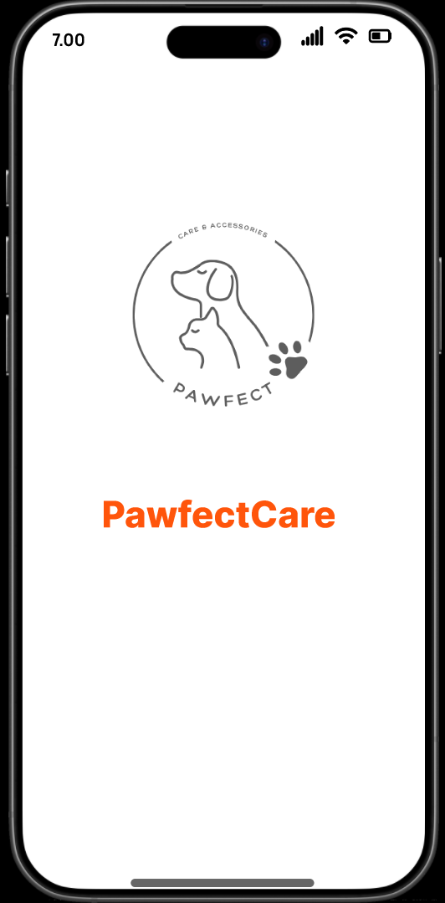 | 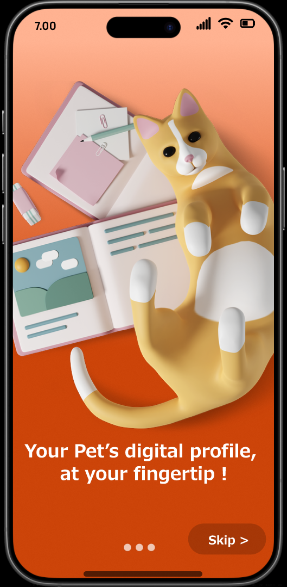 | 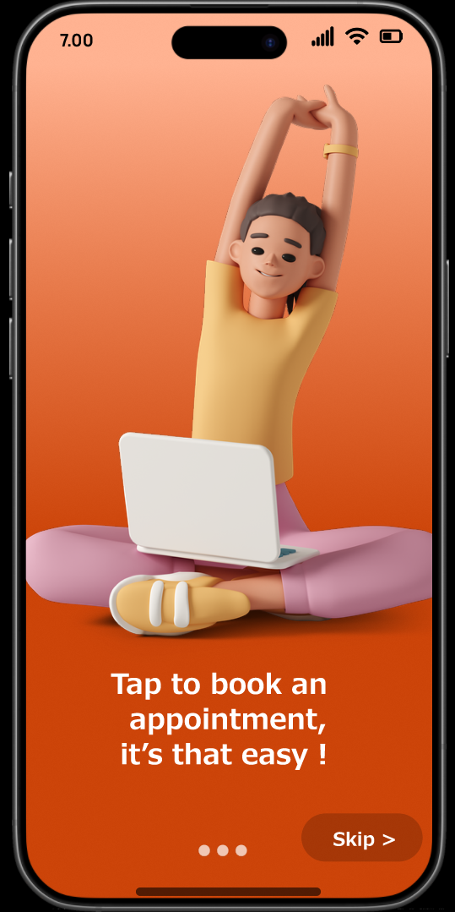 | 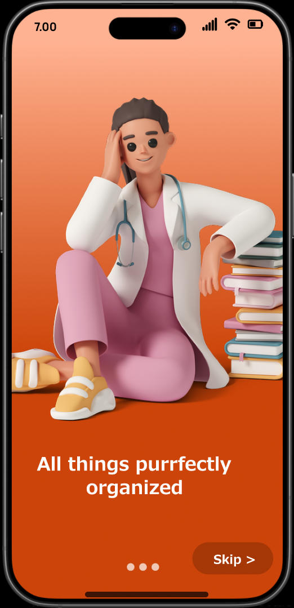 |

### 2. Authentication
Secure and friendly login/signup flows.

| Get Started | Login | Sign Up 
|:---:|:---:|:---:|:---:|
| 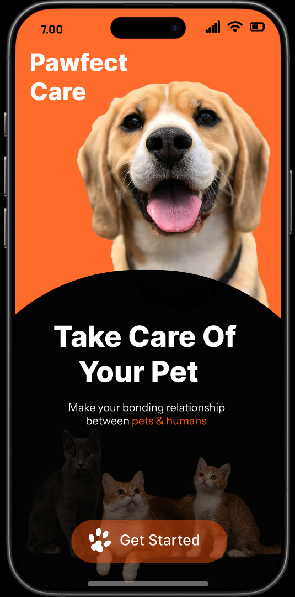 | 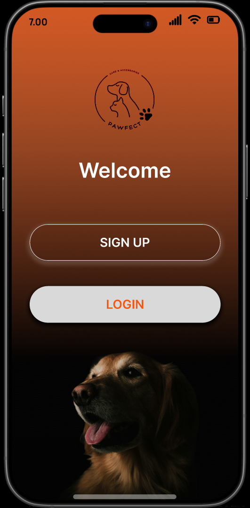 | 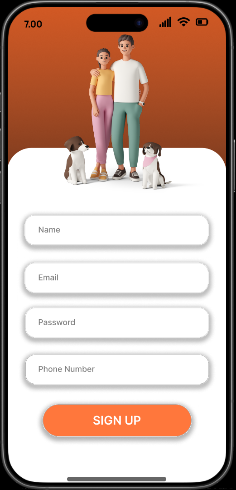 

### 3. Dashboard & Pet Management
The core hub for managing pets and viewing daily summaries.

| Home Dashboard | Add New Pet | Pet Health Card | edit pet profile | Visit Summary |
|:---:|:---:|:---:|:---:|
| 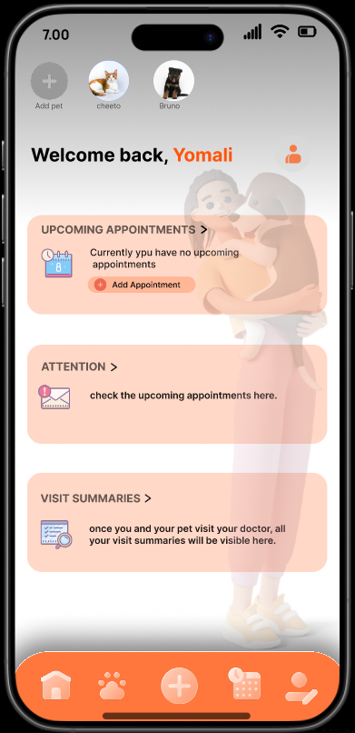 | 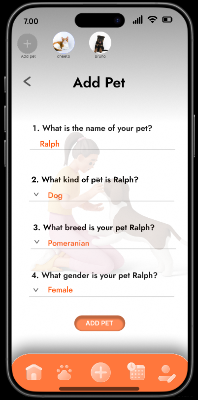 | 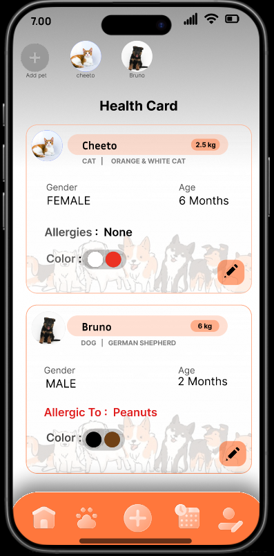 | 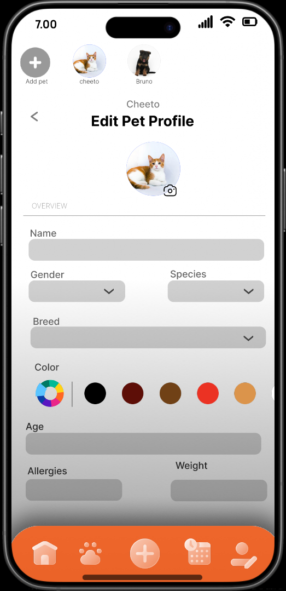 | 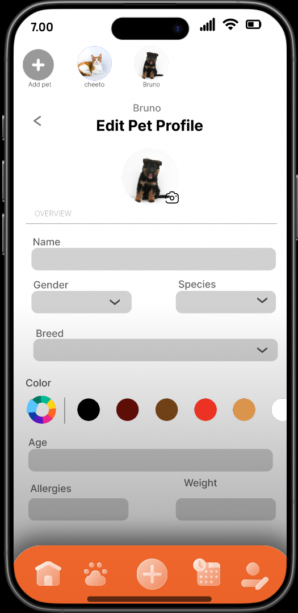 | 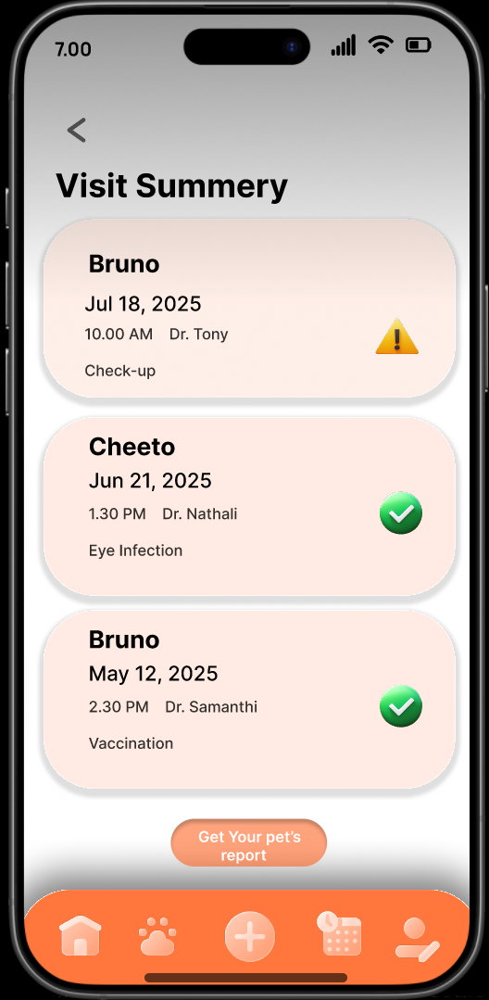 |

### 4. Appointments & Reports
Booking flow and medical history tracking.

| Upcoming | Book Appointment | Booking Success | Medical Reports |
|:---:|:---:|:---:|:---:|
| 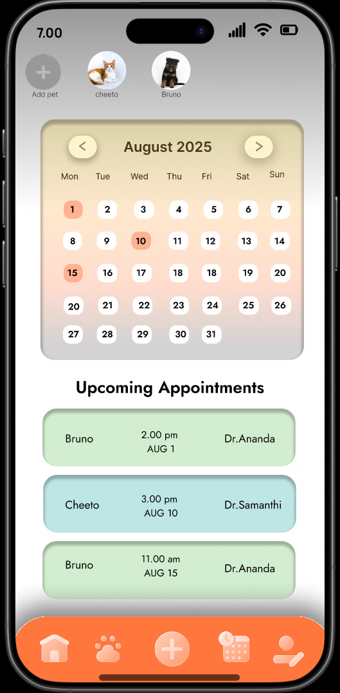 | 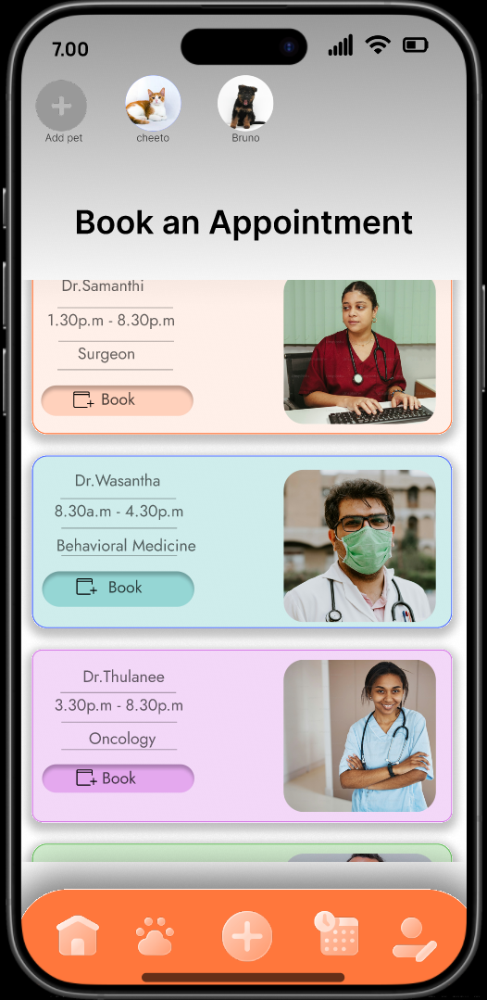 | 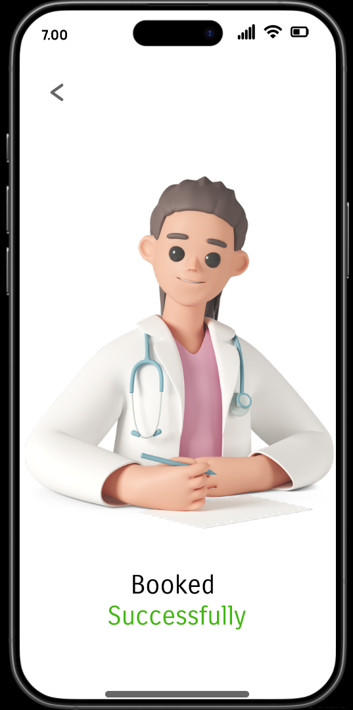 | 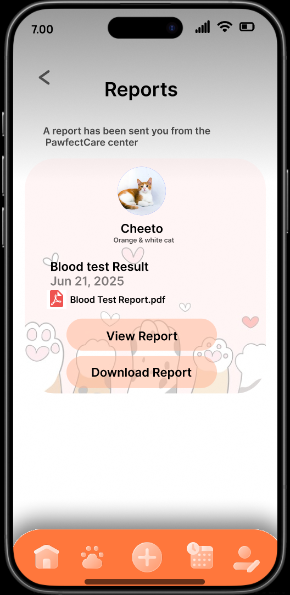 |

### 5. Profile & Settings
User personalization and preferences.

| Account | Edit Profile | Change Password | Password Success | Language |
|:---:|:---:|:---:|:---:|
| 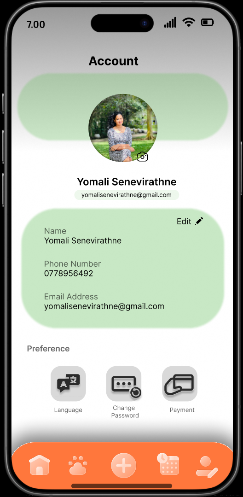 | 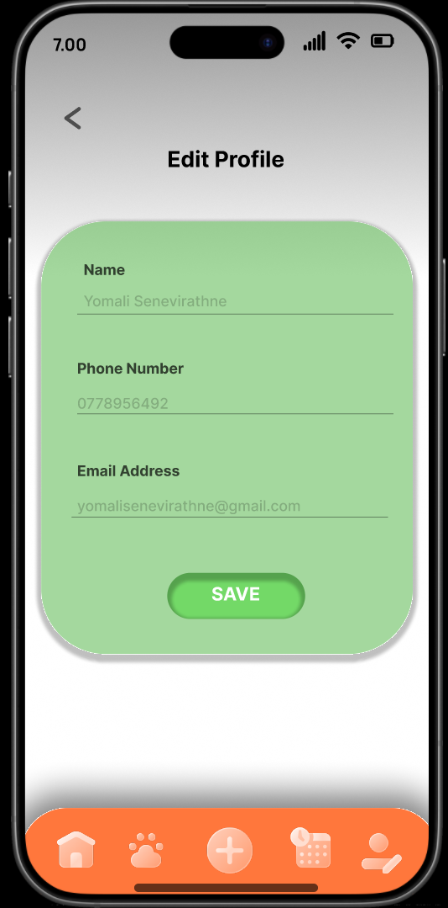 | 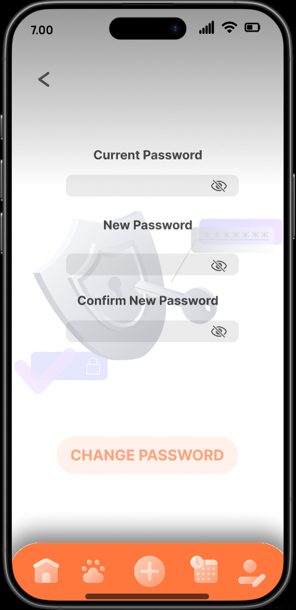 | 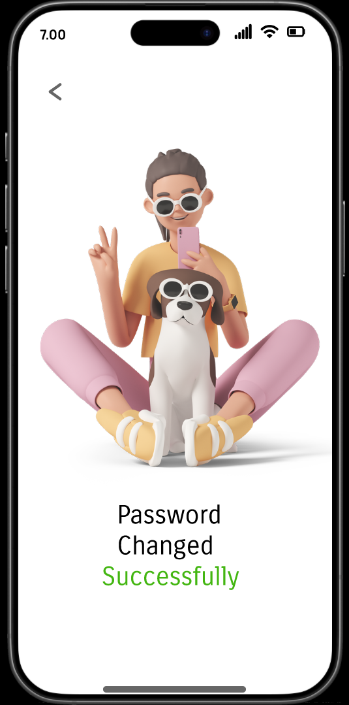 | 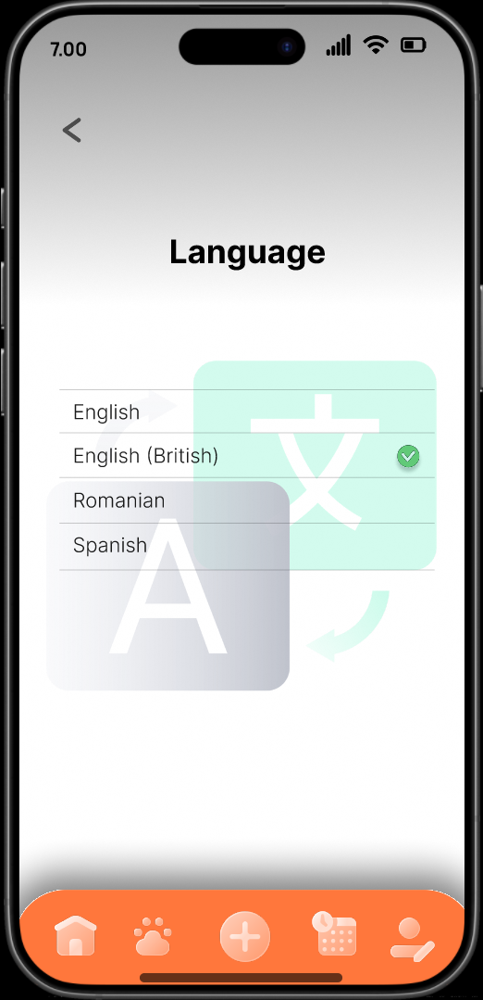 |

---

## 🖌️ Design System

*   **Color Palette:**
    *   🟠 **Primary:** `#FF7F50` (Burnt Orange) - Represents energy and warmth.
    *   ⚪ **Secondary:** `#FFFFFF` (White) - For a clean, medical-grade look.
    *   🟢 **Accent:** `#4CAF50` (Green) - Used for success states and health indicators.
*   **Typography:** Sans-serif font family for high readability.

---

## 👤 Designer

**Yomali Senevirathne**
*   **Role:** UI/UX Designer
*   **Tools:** Figma
*   **Contact:** [yomalisenevirathne@gmail.com](mailto:yomalisenevirathne@gmail.com)

---
*Designed with ❤️ for Pets* 🐾
